# Multi-Agent Booking System

A multi-agent travel booking system built with LangGraph, FastAPI, Pinecone RAG, and MCP (Model Context Protocol) for flight search and booking.

---

## System Architecture

```mermaid
flowchart TD
    User([👤 User]) -->|POST /chat| API[FastAPI\nmain.py]

    subgraph Session["Session Layer"]
        SQLite[(SQLite\nsessions.db)]
    end

    API -->|load_session| SQLite
    SQLite -->|previous state| API

    API --> Router[🔀 Router Agent\ngpt-4o-mini]

    subgraph Agents["Agent Layer  —  LangGraph"]
        Router -->|booking intent| BA[✈️ Booking Agent\ngpt-4o-mini]
        Router -->|complaint intent| CA[📋 Complaint Agent\ngpt-4o-mini]
        Router -->|info intent| IA[💡 Information Agent\ngpt-4o-mini]
    end

    subgraph DataSources["Data Sources"]
        MCP[🛫 MCP Server\nmcp_server_flights.py]
        PC[(🌲 Pinecone\ntravel-knowledge\ncosine · serverless AWS)]
    end

    BA -->|search_flights tool| MCP
    MCP -->|flight options| BA

    IA -->|embed + similarity search\ntext-embedding-3-small| PC
    PC -->|top-4 docs| IA

    BA --> Response
    CA --> Response
    IA --> Response

    Response[📨 Final Response] -->|save_session| SQLite
    Response -->|HTTP 200| User

    style Session fill:#2d1b4e,color:#fff
    style Agents fill:#1a3a1a,color:#fff
    style DataSources fill:#1e3a5f,color:#fff
```



---

## RAG Pipeline

```mermaid
flowchart LR
    subgraph Seed["Seed Pipeline — run once"]
        TD[rag/travel_knowledge.py\n16 LangChain Documents] -->|import| SP[rag/seed_pinecone.py]
        SP -->|text-embedding-3-small\n1536 dims| EMB[Embeddings]
        EMB -->|upsert| PC[(Pinecone\ntravel-knowledge)]
    end

    subgraph Runtime["Runtime — per query"]
        Q([User Query]) --> KS[TravelKnowledgeStore.retrieve]
        KS -->|embed query| QE[Query Embedding\ntext-embedding-3-small]
        QE -->|similarity_search top-4| PC
        PC -->|top-4 Documents| CTX[Retrieved Context]
        CTX --> PROMPT[ChatPromptTemplate\n+ gpt-4o-mini]
        PROMPT --> R([Grounded Response])
    end

    style Seed fill:#1e3a5f,color:#fff
    style Runtime fill:#1a3a1a,color:#fff
```



---

## Agent Interaction Sequence

```plantuml
@startuml
skinparam sequenceMessageAlign center
skinparam backgroundColor #1e1e2e
skinparam sequenceArrowColor #89b4fa
skinparam participantBackgroundColor #313244
skinparam participantBorderColor #89b4fa
skinparam participantFontColor #cdd6f4
skinparam actorBackgroundColor #313244
skinparam actorBorderColor #a6e3a1
skinparam actorFontColor #cdd6f4
skinparam databaseBackgroundColor #45475a
skinparam databaseBorderColor #fab387
skinparam noteFontColor #cdd6f4
skinparam noteBackgroundColor #45475a

actor       User                      as user
participant "FastAPI\nmain.py"        as api
database    "SQLite\nsessions.db"     as db
participant "Router Agent\ngpt-4o-mini" as router
participant "Booking Agent\ngpt-4o-mini" as ba
participant "Complaint Agent\ngpt-4o-mini" as ca
participant "Information Agent\ngpt-4o-mini" as ia
participant "MCP Server\nFlights"     as mcp
database    "Pinecone\ntravel-knowledge" as pc

user  ->  api    : POST /chat {message, session_id}
api   ->  db     : load_session(session_id)
db    --> api    : previous conversation state

api   ->  router : classify intent

alt booking intent
    router -> ba  : handle booking request
    ba     -> mcp : search_flights(origin, dest, date)
    mcp    --> ba : available flight options
    ba     --> api : booking response
else complaint intent
    router -> ca  : handle complaint request
    ca     --> api : complaint response
else info / general intent
    router -> ia  : handle info request
    ia     -> pc  : embed query → similarity_search top-4
    pc     --> ia : retrieved travel knowledge docs
    ia     --> api : grounded response
end

api -> db  : save_session(session_id, state)
api --> user : HTTP 200 {response}
@enduml
```



---

## Prerequisites

- [Docker Desktop](https://www.docker.com/products/docker-desktop/) installed and running
- An `OPENAI_API_KEY`
- A `PINECONE_API_KEY` (free tier is sufficient — [app.pinecone.io](https://app.pinecone.io))

---

## Setup

1. Clone the repository and navigate to the project folder.

2. Create a `.env` file in the project root:

   ```
   OPENAI_API_KEY=your_openai_api_key_here
   PINECONE_API_KEY=your_pinecone_api_key_here
   PINECONE_INDEX_NAME=travel-knowledge
   DEBUG=False
   ```

---

## Seeding Pinecone (required before first run)

The RAG knowledge base must be seeded **once** before starting the main service. This creates the `travel-knowledge` index in Pinecone and upserts 16 curated travel documents.

### Run the seed container

```bash
docker compose --profile seed run --rm --build seed-pinecone
```

Expected output:

```
[Seed] Connecting to Pinecone index 'travel-knowledge' …
[Pinecone] Creating index 'travel-knowledge' …
[Pinecone] Index 'travel-knowledge' is ready.
[Seed] Upserting 16 documents …
[Pinecone] Upserted 16 documents.
[Seed] Done.
```

### What gets seeded?

| Category | Destinations / Topics |
|---|---|
| Destination guides | London, Paris, Tokyo, Dubai, Bali, New York, India, Rome, Barcelona, Bangkok |
| Travel tips | General tips, budget travel, airports & flights |
| Requirements | Visa guide, health & vaccinations |
| Regional guide | Europe / Schengen zone |

### Re-seeding after edits

To add or update documents, edit [`rag/travel_knowledge.py`](rag/travel_knowledge.py) then re-run the same command. Vectors are overwritten in place — no duplicates are created.

> **Note:** On subsequent runs the Pinecone index already exists, so only the upsert step runs.

---

## Running with Docker Desktop

### macOS

1. Open **Docker Desktop** and make sure it is running (whale icon in the menu bar).

2. Open **Terminal** and navigate to the project directory:

   ```bash
   cd "multiagent booking system"
   ```

3. Build and start the containers:

   ```bash
   docker compose up -d --build
   ```

4. Verify the container is running:

   ```bash
   docker compose ps
   ```

5. The API will be available at: `http://localhost:8000`

6. To stop the service:

   ```bash
   docker compose down
   ```

---

### Windows

1. Open **Docker Desktop** and make sure it is running (whale icon in the system tray).

   > Docker Desktop on Windows requires either **WSL 2** (recommended) or **Hyper-V** as the backend. Ensure WSL 2 is enabled if prompted during installation.

2. Open **Command Prompt** or **PowerShell** and navigate to the project directory:

   ```powershell
   cd "multiagent booking system"
   ```

3. Build and start the containers:

   ```powershell
   docker compose up -d --build
   ```

4. Verify the container is running:

   ```powershell
   docker compose ps
   ```

5. The API will be available at: `http://localhost:8000`

6. To stop the service:

   ```powershell
   docker compose down
   ```

---

## Useful Commands

| Command | Description |
|---|---|
| `docker compose up -d --build` | Build images and start containers in the background |
| `docker compose ps` | Show running containers |
| `docker compose logs -f` | Stream container logs |
| `docker compose down` | Stop and remove containers |
| `docker compose down -v` | Stop containers and remove volumes |

---

## Health Check

Once running, verify the service is healthy:

```bash
curl http://localhost:8000/health
```
